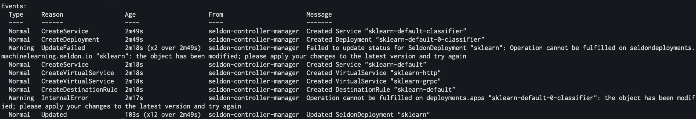

# seldon-deployment

## Setting up the program

In order to run this program, you must have:

- Access to a kubernetes cluster, minkube was used to test the program.
- seldon-core running on your kubernetes cluster.
- A namespace created in kubernetes for the resource to be deployed in.

Run `go mod vendor` to fetch the packages defined in go.mod

## Running the program

This program takes two arguments:
`namespace` and `filename`
Example usage:

`go run main.go -namespace seldon -filename deployment.yml`

*namespace*: indicates which kubernetes namespace you want to deploye the resource in

*filename*: indicates the filename of the seldon custom resource definition that you wish to deploy

The program will

1. Create the resource as defined in `filename` in the namespace `namespace`.
2. Wait until the resource has scaled to one replica.
3. Increase the number of replicas to two replicas.
4. Wait until the resource has scaled to two replicas.
5. Delete the resource.

## Files

There are two go files: main.go and seldonDeploymentController.go.

### main.go

- Handles the parsing of the kubeconfig.
- Handles the parsing of the yaml definition.
- Orchestrates the creating, updating and deleting of the resource.

### seldonDeploymentController.go

- Provides an interface for main.go to interact with to abstract away some elements of the K8s api.
- Uses the [seldon client set]("github.com/seldonio/seldon-core/operator/client/machinelearning.seldon.io/v1/clientset/versioned") as the client for interacting with the K8s api. This was used as it already has built into it methods around handling seldon deployments.
- Provides a method to create a seldon deployment.
- Provides a method to update the replicas for a seldon deployment.
- Provides a method to wait until a given replica number has been reached for the seldon deployment. An arbitrary interval of 4 seconds was chosen for polling the status of the deployment.
- Provides a method to delete the seldon deployment.

## Event Logs

The following logs were fetched using `kubectl describe seldondeployment <deployment name>` before the deployment was deleted.

## Limitations

- The program doesn't provide any method for logging events produced by the seldon deployment.
- The program assumes the initial definition of the deployment desires one replica.
- The program assumes the kubernetes config exists at ~/kube/config
- The program's 4 second polling interval may be too long for certain use cases that are time sensitive. If used in production, the interval would be tweaked according to the use case.
- There are no tests for the code, the code was verified by looking at the program logs and using the kubectl cli. If this code were to be used in production, tests would be added to ensure behaviour is as expected.
